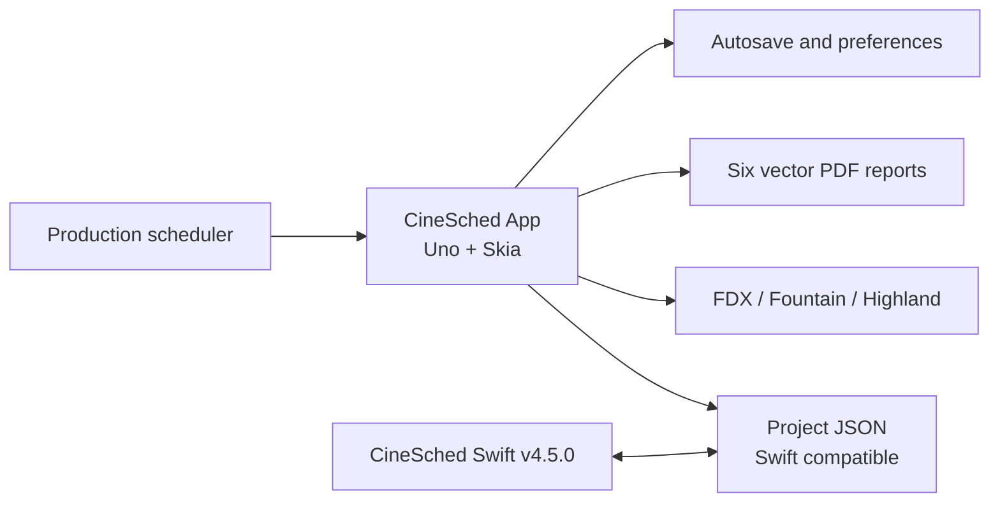
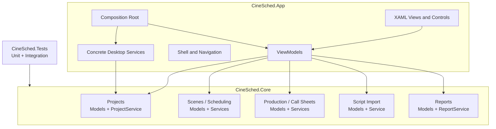
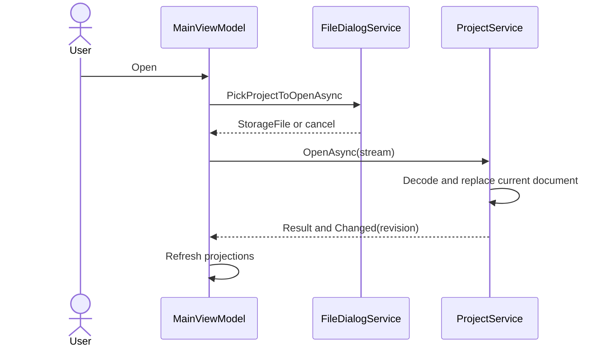
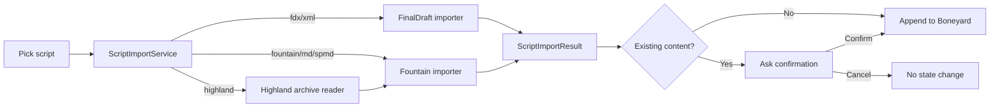
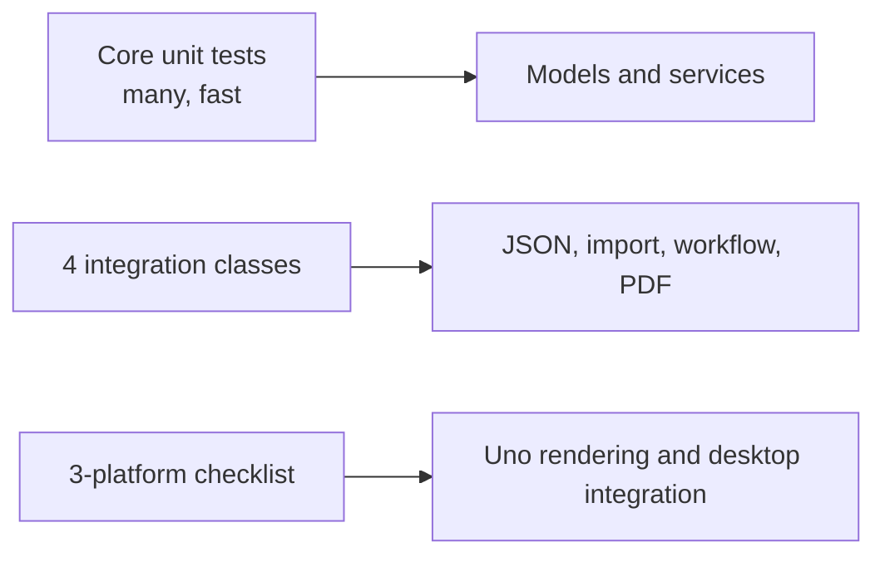

# CineSched .NET: arquitectura objetivo

## 1. Propósito

Este documento define cómo se construirá CineSched multiplataforma. [SPEC.md](SPEC.md) determina el comportamiento y [MIGRATION-PLAN.md](MIGRATION-PLAN.md) determina el orden de entrega.

La arquitectura tiene dos proyectos de producción:

- `CineSched.Core`: vertical slices completas; cada una contiene un `Models.cs` y un único service con todas sus operaciones.
- `CineSched.App`: interfaz Uno y servicios concretos del entorno de escritorio.

La regla central es estricta: **App depende de Core; Core nunca depende de App, Uno, WinUI ni una plataforma**.

## 2. Contexto del sistema



CineSched es una aplicación local, de una ventana y un proyecto abierto a la vez. No existe backend, autenticación o base de datos. Todos los límites externos son archivos o preferencias locales.

## 3. Decisiones arquitectónicas

### ADR-001: Uno Platform en lugar de WinUI 3 puro

WinUI 3 no se ejecuta en Linux. Uno proyecta el modelo de controles y XAML de WinUI sobre otras plataformas. Skia Desktop se utilizará en Linux, Windows y macOS para que calendario, stripboard, fuentes y animaciones tengan una composición consistente.

### ADR-002: dos proyectos de producción

El proyecto solicitó una separación clara de lógica y UI sin la ceremonia de Clean Architecture completa. Por eso no habrá proyectos separados Domain, Application e Infrastructure.

- Core agrupa entidades y operaciones por vertical slice; no tendrá carpetas horizontales separadas de Domain, Application, Ports o Infrastructure.
- App agrupa UI y servicios concretos que necesitan APIs del host.
- Un único proyecto `CineSched.Tests` contiene pruebas unitarias y las pocas integraciones de alto valor.

### ADR-003: un service por vertical slice

Cada capacidad se organiza por feature, no por operación. Sus modelos se agrupan en `Models.cs` y todas sus funciones públicas en `<Feature>Service.cs`. No existen handlers individuales, bus global, reflexión ni una carpeta por comando.

### ADR-004: estado de documento centralizado

`ProjectService` es la única autoridad mutable de una ventana. Los demás services reciben parámetros o modelos simples, construyen un nuevo estado válido y solicitan a `ProjectService` aplicar el cambio. La UI nunca modifica listas del documento directamente.

### ADR-005: streams como límite simple de archivos

Core lee y escribe `Stream`. App decide cómo obtenerlo mediante servicios concretos de pickers, permisos y rutas. No se modelan ports ni adapters: el stream es suficiente para mantener Core portable.

### ADR-006: PDFsharp Core y fuentes embebidas

Los reportes se generan con PDFsharp Core 6.2.4. Roboto Regular, Bold e Italic se incluyen como recursos desde `FontLibrary.libRoboto`, con licencia Apache 2.0 para la tipografía y un font resolver propio. El PDF no depende de AppKit, PDFKit, GDI ni fuentes instaladas.

## 4. Diagrama de dependencias



### Dependencias NuGet permitidas

| Proyecto | Dependencias directas permitidas |
|---|---|
| `CineSched.Core` | BCL de .NET 10 y PDFsharp 6.2.4 |
| `CineSched.App` | Uno SDK 6.6.42, CommunityToolkit.Mvvm 8.4.2 y `CineSched.Core` |
| `CineSched.Tests` | xUnit, test SDK y `CineSched.Core` |

Core no puede referenciar `Microsoft.UI.Xaml`, `Windows.Storage.Pickers`, `DispatcherQueue`, tipos de ventana, clipboard o controles.

## 5. Estructura de archivos objetivo

```text
CineSched.slnx
global.json
Directory.Build.props
Directory.Packages.props
MIGRATION-PLAN.md
SPEC.md
ARCHITECTURE.md

src/
  CineSched.Core/
    CineSched.Core.csproj
    Common/
      Models.cs
    Features/
      Projects/
        Models.cs
        ProjectService.cs
      Scenes/
        Models.cs
        SceneService.cs
      Scheduling/
        Models.cs
        SchedulingService.cs
      Stripboard/
        Models.cs
        StripboardService.cs
      Production/
        Models.cs
        ProductionService.cs
      CallSheets/
        Models.cs
        CallSheetService.cs
      Conflicts/
        Models.cs
        ConflictService.cs
      ScheduleLock/
        Models.cs
        ScheduleLockService.cs
      ScriptImport/
        Models.cs
        ScriptImportService.cs
      Reports/
        Models.cs
        ReportService.cs
      Settings/
        Models.cs
        SettingsService.cs

  CineSched.App/
    CineSched.App.csproj
    App.xaml
    App.xaml.cs
    Bootstrap/
      ServiceRegistration.cs
    Shell/
      MainPage.xaml
      MainViewModel.cs
      MenuDefinitions.cs
    Features/
      Projects/
      Scenes/
      Scheduling/
      Stripboard/
      Production/
      CallSheets/
      Conflicts/
      ScheduleLock/
      Reports/
      Settings/
    Controls/
      SceneStrip.xaml
      CalendarDay.xaml
      BoneyardView.xaml
      TimelineRow.xaml
    Services/
      NavigationService.cs
      DialogService.cs
      AppLifecycleService.cs
      FileDialogService.cs
      PreferencesService.cs
      AutosaveService.cs
      RecentFilesService.cs
    Platforms/
      Windows/
      Linux/
      MacOS/
    Resources/
      Strings/
        en/
        es/
      Themes/
    Assets/
      Fonts/
      Images/

tests/
  CineSched.Tests/
    CineSched.Tests.csproj
    Unit/
      ProjectServiceTests.cs
      SceneServiceTests.cs
      SchedulingServiceTests.cs
      StripboardServiceTests.cs
      ProductionServiceTests.cs
      CallSheetServiceTests.cs
      ConflictServiceTests.cs
      ScheduleLockServiceTests.cs
      ScriptImportServiceTests.cs
      ReportServiceTests.cs
    Integration/
      ProjectCompatibilityPipelineTests.cs
      ScriptImportPipelineTests.cs
      ProjectWorkflowPipelineTests.cs
      ReportGenerationPipelineTests.cs
    TestAssets/
      Projects/
      Scripts/
      Expected/

packaging/
  linux/
    AppDir/
    build-appimage.ps1
  windows/
  macos/

.github/
  workflows/
    build-test-publish.yml
```

La lista muestra destinos arquitectónicos, no obliga a crear carpetas vacías. Una carpeta aparece cuando contiene su primer tipo real.

No existe un directorio `Domain` separado. Cada slice tiene dos archivos principales:

- `Models.cs`: todas las entidades, enums, DTOs, parámetros y resultados propios de la feature.
- `<Feature>Service.cs`: todas las operaciones públicas y helpers privados de esa feature.

Por ejemplo, `Scene`, `DayNightType` y los datos de edición viven juntos en `Features/Scenes/Models.cs`; crear, editar, duplicar, eliminar, buscar, ordenar y hacer parsing viven juntos en `SceneService.cs`. `Common/Models.cs` solo contiene `Result<T>`, `Error` y valores realmente transversales.

## 6. Anatomía de un vertical slice

Cada slice expone un único service concreto. No se crea una clase handler ni una carpeta por operación. Los parámetros complejos y resultados se declaran junto a las entidades en `Models.cs`.

```csharp
// Features/Scheduling/Models.cs
public sealed record ShootDay(Guid Id, DateTimeOffset Date, IReadOnlyList<Scene> Scenes);

public sealed record MoveScenesRequest(
    IReadOnlyList<Guid> SceneIds,
    Guid? SourceDayId,
    Guid TargetDayId,
    int TargetIndex);

// Features/Scheduling/SchedulingService.cs
public sealed class SchedulingService
{
    public Result<ProjectDocument> ChangeDateRange(ChangeDateRangeRequest request)
        => throw new NotImplementedException();

    public Result<ProjectDocument> MoveScenes(MoveScenesRequest request)
        => throw new NotImplementedException();

    public Result<ProjectDocument> ReorderScenes(ReorderScenesRequest request)
        => throw new NotImplementedException();

    public Result<ProjectDocument> MoveWholeDay(MoveWholeDayRequest request)
        => throw new NotImplementedException();

    public Result<ProjectDocument> SetBlackout(SetBlackoutRequest request)
        => throw new NotImplementedException();

    public Result<ProjectDocument> Undo()
        => throw new NotImplementedException();

    public Result<ProjectDocument> Redo()
        => throw new NotImplementedException();
}
```

Reglas:

- `Models.cs` contiene todos los modelos de la slice y no referencia controles.
- El service valida invariantes y devuelve `Result<T>`; los errores esperados no usan excepciones.
- El service obtiene y aplica el estado mediante `ProjectService` una sola vez por operación.
- Una operación estructural captura undo antes de aplicar y limpia redo.
- Los métodos de consulta no cambian dirty state ni historial.
- Los algoritmos auxiliares se mantienen como métodos privados en el mismo service.
- No existen carpetas horizontales `Domain`, `Application`, `Ports`, `Adapters` o `Services` en Core. Cada entidad y operación pertenece a una vertical slice.

## 7. Modelo de estado

### `ProjectDocument`

Representa exclusivamente datos compartibles en JSON:

```csharp
public sealed record ProjectDocument(
    IReadOnlyList<Scene> AllScenes,
    IReadOnlyList<ShootDay> ShootDays,
    string ProjectTitle,
    DateTimeOffset CreatedDate,
    bool? IsShiftModeEnabled,
    ProductionInfo? ProductionInfo);
```

Los nombres C# pueden seguir PascalCase; los métodos JSON de `ProjectService` controlan los nombres wire camelCase.

### `ProjectService`

Es el único service con estado de ejecución que no se serializa dentro del documento:

- `CurrentDocument`.
- `IsDirty`.
- Undo y redo, máximo 30 snapshots.
- Número monotónico de revisión para ignorar autosaves obsoletos.
- Evento portable `Changed`, con tipo de cambio y revisión.

El archivo manual asociado, sus permisos y recientes permanecen en los services de App. Los demás services de Core llaman los métodos internos de `ProjectService` para leer un snapshot y aplicar un resultado. `SchedulingService.Undo` y `SchedulingService.Redo` usan el historial mantenido por `ProjectService`.

### Mutabilidad

Los modelos expuestos se tratan como valores. Cada service crea colecciones nuevas para la parte modificada y reutiliza valores inmutables no afectados. Esto hace seguro el snapshot de undo y evita que una vista modifique Core por referencia.

## 8. Contratos públicos

### Resultado y errores

```csharp
public sealed record Error(
    string Code,
    string MessageKey,
    IReadOnlyDictionary<string, object?> Details);

public readonly record struct Result<T>(T? Value, Error? Error)
{
    public bool IsSuccess => Error is null;
}
```

`Code` es estable para pruebas y decisiones UI. `MessageKey` se localiza en App. `Details` transporta nombres de campo, formato o archivo sin contener tipos de UI.

Errores base:

- `project.invalid-json`, `project.unsupported-data`, `project.read-failed`, `project.write-failed`.
- `scene.validation-failed`, `scene.not-found`, `schedule.invalid-target`.
- `import.unsupported-extension`, `import.invalid-fdx`, `import.invalid-highland`, `import.no-scenes`.
- `report.no-data`, `report.generation-failed`.

### Servicios concretos de Core

```csharp
public sealed class ProjectService
{
    public ProjectDocument CurrentDocument { get; }
    public bool IsDirty { get; }

    public Result<ProjectDocument> NewProject(DateTimeOffset now)
        => throw new NotImplementedException();

    public ValueTask<Result<ProjectDocument>> OpenAsync(
        Stream source, CancellationToken cancellationToken)
        => throw new NotImplementedException();

    public ValueTask<Result<Unit>> SaveAsync(
        Stream destination,
        CancellationToken cancellationToken)
        => throw new NotImplementedException();
}

public sealed class ScriptImportService
{
    public bool Supports(string extension)
        => throw new NotImplementedException();

    public ValueTask<Result<ScriptImportResult>> ImportAsync(
        Stream source,
        string extension,
        CancellationToken cancellationToken)
        => throw new NotImplementedException();
}

public sealed class ReportService
{
    public ValueTask<Result<Unit>> GenerateAsync(
        ReportKind kind,
        ReportRequest request,
        Stream destination,
        CancellationToken cancellationToken)
        => throw new NotImplementedException();
}
```

`ReportKind` contiene exactamente `Schedule`, `Stripboard`, `ShootingSchedule`, `DaysOutOfDays`, `Breakdown` y `CallSheet`.

Estas clases viven dentro de sus respectivas slices (`Projects`, `ScriptImport` y `Reports`). Cada una concentra todas las operaciones públicas de su feature; los parsers y renderers son métodos privados del mismo service. No se crean interfaces ni handlers por operación.

### Servicios concretos de App

```csharp
public sealed class FileDialogService
{
    public ValueTask<StorageFile?> PickProjectToOpenAsync(CancellationToken cancellationToken)
        => throw new NotImplementedException();

    public ValueTask<StorageFile?> PickScriptToImportAsync(CancellationToken cancellationToken)
        => throw new NotImplementedException();

    public ValueTask<StorageFile?> PickProjectToSaveAsync(
        string suggestedName, CancellationToken cancellationToken)
        => throw new NotImplementedException();

    public ValueTask<StorageFile?> PickReportToSaveAsync(
        string suggestedName, CancellationToken cancellationToken)
        => throw new NotImplementedException();
}

public sealed class PreferencesService
{
    public T Get<T>(string key, T fallback)
        => throw new NotImplementedException();

    public ValueTask SetAsync<T>(string key, T value, CancellationToken cancellationToken)
        => throw new NotImplementedException();
}
```

App puede usar `StorageFile` y otros tipos Uno porque esos tipos no cruzan a Core. `FileDialogService` abre el stream y entrega únicamente el stream, extensión y datos simples al service correspondiente.

`AutosaveService` guarda snapshots en app data y `RecentFilesService` conserva máximo diez entradas únicas. Cuando un service Core necesita la hora actual, su método recibe explícitamente `DateTimeOffset now`; las pruebas no requieren una abstracción de reloj.

## 9. Compatibilidad JSON

### Wire format

- `System.Text.Json` escribe propiedades camelCase y JSON UTF-8 indentado.
- Enums utilizan strings idénticos a Swift: por ejemplo `DAY`, `NIGHT`, `Company Move` y `Lunch`.
- Fechas nuevas se escriben con `yyyy-MM-dd'T'HH:mm:ssZ`, sin depender de la cultura actual.
- El decoder acepta ese formato y números de segundos desde la reference date de Apple: 2001-01-01T00:00:00Z.
- UUID se escriben como strings canónicos y se leen sin sensibilidad a mayúsculas.
- `cast` acepta array o string separado por comas; siempre se escribe como array.
- Campos añadidos históricamente reciben los mismos defaults que los inicializadores Swift.
- El top-level legacy `{ allScenes, shootDays }` se proyecta a `ProjectDocument` con defaults.
- Campos desconocidos se ignoran para mantener forward tolerance.
- Preferencias App nunca se agregan a `ProjectDocument`.

### Escritura segura

Save y autosave serializan un snapshot con revisión fija. Para un archivo manual, App escribe primero a un temporal en el mismo directorio, flush, y reemplaza el destino de forma atómica si el host lo permite. Si falla, conserva destino anterior e `IsDirty=true`.

## 10. Flujos principales

### Abrir un proyecto



Cancelación o error termina antes de reemplazar `CurrentDocument`, por lo que el proyecto actual no cambia.

### Modificar y autosave


El autosave no limpia el dirty state de un archivo manual. Solo Save/Save As confirmado lo hace.

### Importar un guion



### Generar un reporte

App solicita el destino, construye los parámetros desde un snapshot, llama `ReportService.GenerateAsync` con el `ReportKind` y le entrega un stream. El service calcula layout y escribe PDF. Solo después de éxito App muestra confirmación; los reportes nunca mutan `ProjectService`.

## 11. Reglas de dominio compartidas

- `duration` usa octavos enteros; `estimatedTime` usa minutos enteros.
- Scene number se ordena por parte numérica y sufijo alfabético.
- `DayNightType` conserva los seis valores actuales y su orden semántico.
- `ShootDay.Date` identifica el slot; mover el contenido no cambia la fecha del contenedor.
- Scene IDs son la identidad de drag-and-drop y selección; nunca se usa un índice como identidad.
- `ScheduleLock` captura working days por personaje normalizado y no bloquea operaciones.
- Conflicts y lock changes son queries derivadas; no se persisten como caches.
- Timeline se calcula desde general call, duración y `customStartTime`; el resultado derivado no necesita persistirse.
- DOOD es una proyección determinista de working days, hold policy, blackout y unavailable ranges.

## 12. Arquitectura de UI

### Shell

`MainPage` contiene:

1. `MenuBar` para File, Edit, View y Production.
2. `CommandBar` para acciones frecuentes, búsqueda y selector Calendar/Stripboard.
3. Sidebar colapsable con título, rango, creación de escena y Boneyard.
4. Área central para Calendar o Stripboard.
5. Capa de dialogs y notificaciones.

La navegación no reemplaza el documento. Dialogs editan drafts y solo llaman el método correspondiente del service al confirmar.

### View models

- Derivan de `ObservableObject` y usan `[ObservableProperty]`/`[RelayCommand]` sobre partial classes.
- Exponen colecciones proyectadas para binding, nunca entidades mutables de Core.
- Traducen `Error.MessageKey` a recursos localizados.
- Mantienen exclusivamente estado efímero de UI: selección, dialog abierto, hover, scroll y loading.
- Cancelan operaciones async al cerrar la vista o reemplazar proyecto.

### Drag-and-drop

El payload contiene UUIDs serializados y tipo de operación, no objetos completos. App calcula el target visual y llama `SchedulingService.MoveScenes`. Core vuelve a validar source, target, posición e invariantes. El mismo método sirve a drag-and-drop, Send to Day y context menus.

### Animaciones

Se utilizan Storyboards/Composition para opacity y transforms cortos, normalmente 150-200 ms. La animación refleja una transición de estado ya confirmada; nunca determina posición, tiempo o resultado de dominio.

### Localización y temas

- Recursos `.resw` en `en` y `es` sustituyen el diccionario Swift.
- Core utiliza keys estables para errores y labels industriales; el PDF recibe un `ReportCulture` explícito.
- Los temas `system`, `blue`, `green` y `yellow` se definen como ResourceDictionaries light/dark.
- Tema, idioma y sidebar se guardan mediante `PreferencesService` en App, no en el proyecto.

## 13. Servicios de plataforma

El código condicional solo se permite dentro de `CineSched.App/Platforms` o en partial classes de sus servicios concretos. No se define una capa de ports/adapters.

### File dialogs

- Preferencia: pickers Uno con APIs WinUI compatibles.
- Si un target no conserva acceso persistente, `RecentFilesService` almacena el token/bookmark apropiado con código específico de plataforma.
- Cancelar devuelve `null`; permisos o I/O devuelven `Error` presentable.

### Recientes

- Windows/Linux pueden conservar path/token conforme a permisos del host.
- macOS debe conservar acceso mediante el mecanismo ofrecido por el host Uno o código específico de bookmark en `RecentFilesService`.
- Resolver una entrada nunca debe iniciar la carga automáticamente.
- Entradas inexistentes o stale se eliminan sin romper startup.

### App data

Autosave y preferencias se guardan en el directorio de datos apropiado para cada plataforma. Ninguna ruta absoluta se comparte dentro del JSON.

## 14. Reportes

Cada reporte se divide en:

1. Query/projection desde `ProjectDocument`.
2. Modelo de layout independiente de PDFsharp.
3. Renderer PDFsharp que dibuja páginas.

Esto permite probar reglas como DOOD, timeline, paginación y alturas sin inspeccionar gráficos. Los integration tests abren el PDF final para validar estructura y contenido esencial.

El font resolver se registra una vez antes del primer documento y rechaza familias no incluidas. Las seis salidas usan US Letter y conservan orientación definida en `SPEC.md`.

## 15. Errores, logging y observabilidad

- Errores esperados usan `Result<T>`.
- Excepciones se reservan para defectos o fallos inesperados y se convierten a un error en el método público del service.
- App registra diagnóstico local con categoría y stack trace, sin incluir contenido de guiones o información personal.
- Mensajes al usuario son localizables y ofrecen reintentar o cancelar cuando tiene sentido.
- No se agrega telemetría remota.

## 16. Concurrencia

- Los services Core son thread-agnostic; App aplica notificaciones de binding en el dispatcher UI.
- `ProjectService` serializa mutaciones con una única sección crítica corta.
- Parsing, JSON y PDF pueden ejecutarse fuera del UI thread sobre snapshots.
- Cada operación larga acepta `CancellationToken`.
- Autosave registra la revisión capturada y descarta su resultado si una revisión más nueva ya fue guardada.
- Save manual y autosave no escriben simultáneamente el mismo destino.

## 17. Pruebas y límites



- Las pruebas unitarias pasan fechas explícitas en los requests y usan streams en memoria.
- Las cuatro clases de integración viven en el mismo proyecto y usan archivos temporales bajo el test workspace y fixtures versionados.
- Tests no dependen del orden global ni de preferencias reales del usuario.
- UI manual valida lo que aporta valor visual; no se crea una suite extensa y frágil de automatización desktop.

## 18. Build, CI y publicación

La workflow `build-test-publish.yml` tendrá stages:

1. Restore con lock files y versiones centrales.
2. Build Release con warnings como errores para el código .NET nuevo.
3. Core tests e integration tests.
4. Publish por runtime identifier.
5. Package y upload de artifacts.

Runtime identifiers objetivo:

- `linux-x64`, `linux-arm64`.
- `win-x64`, `win-arm64`.
- `osx-x64`, `osx-arm64`.

Entregas:

- Linux: AppImage y `tar.gz` autocontenido.
- Windows: ZIP autocontenido.
- macOS: `.app` autocontenida dentro de ZIP.

Los primeros artifacts no estarán firmados. Packaging no puede modificar binarios fuente ni saltarse tests.

## 19. Guardrails verificables

- Un test arquitectónico falla si `CineSched.Core` referencia assemblies Uno/WinUI.
- Ningún view code-behind contiene parsing, scheduling, JSON o generación PDF.
- Ningún service Core abre pickers, muestra dialogs o consulta rutas del sistema.
- No se agrega estado persistido sin decidir si pertenece al documento compartido o a app data.
- No se cambia el wire format sin fixture Swift y prueba `@compatibility`.
- No se agrega una quinta clase de integración sin documentar la frontera que justifica su valor.
- Toda feature nueva se agrega al `Models.cs` y service de su slice, con pruebas y escenario Gherkin antes de conectarse a UI.
