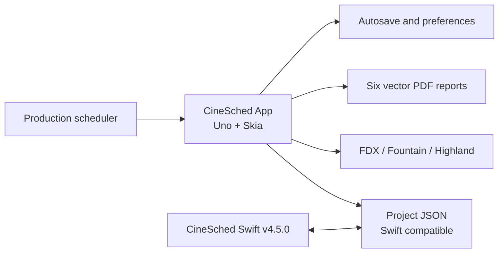
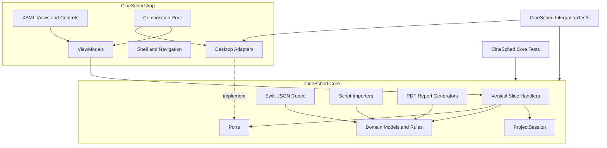
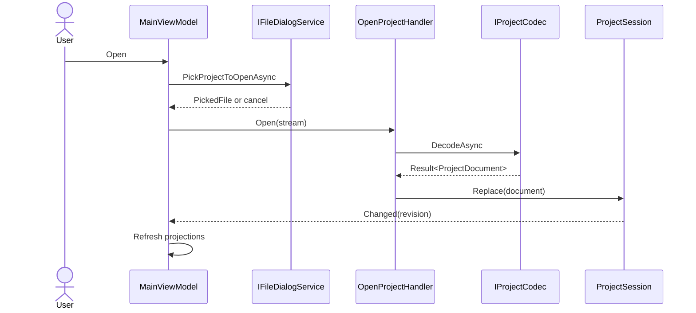
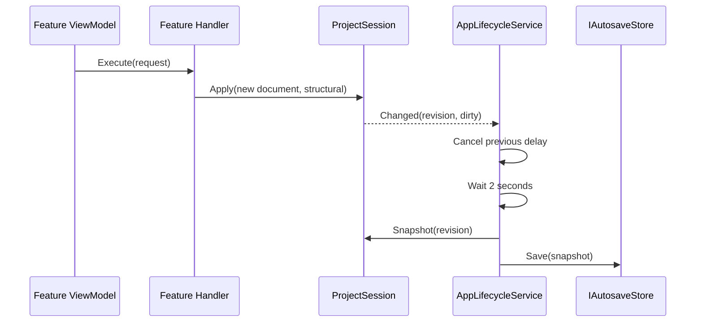
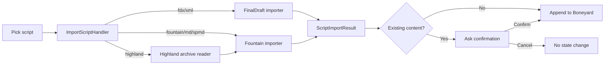
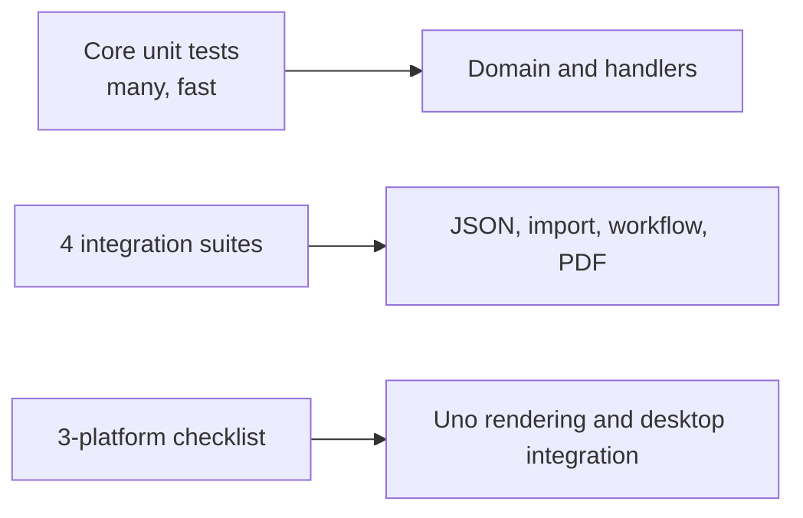

# CineSched .NET: arquitectura objetivo

## 1. Propósito

Este documento define cómo se construirá CineSched multiplataforma. [SPEC.md](SPEC.md) determina el comportamiento y [MIGRATION-PLAN.md](MIGRATION-PLAN.md) determina el orden de entrega.

La arquitectura tiene dos proyectos de producción:

- `CineSched.Core`: estado, dominio, vertical slices y capacidades portables.
- `CineSched.App`: interfaz Uno, composición y adaptadores del entorno de escritorio.

La regla central es estricta: **App depende de Core; Core nunca depende de App, Uno, WinUI ni una plataforma**.

## 2. Contexto del sistema



CineSched es una aplicación local, de una ventana y un proyecto abierto a la vez. No existe backend, autenticación o base de datos. Todos los límites externos son archivos o preferencias locales.

## 3. Decisiones arquitectónicas

### ADR-001: Uno Platform en lugar de WinUI 3 puro

WinUI 3 no se ejecuta en Linux. Uno proyecta el modelo de controles y XAML de WinUI sobre otras plataformas. Skia Desktop se utilizará en Linux, Windows y macOS para que calendario, stripboard, fuentes y animaciones tengan una composición consistente.

### ADR-002: dos proyectos de producción

El proyecto solicitó una separación clara de lógica y UI sin la ceremonia de Clean Architecture completa. Por eso no habrá proyectos separados Domain, Application e Infrastructure.

- Core agrupa dominio, aplicación portable, codecs, importadores y reportes.
- App agrupa UI y adapters que necesitan APIs del host.
- Los proyectos de pruebas no cuentan como capas de producción.

### ADR-003: vertical slices sin MediatR

Cada capacidad se organiza por feature y operación. Un handler se inyecta directamente en el view model o en otro handler; no se incorpora un bus global ni reflexión. Esto mantiene navegación explícita y reduce dependencias.

### ADR-004: estado de documento centralizado

`ProjectSession` es la única autoridad mutable de una ventana. Los handlers reciben requests, construyen un nuevo estado válido y solicitan a la sesión aplicar el cambio. La UI nunca modifica listas del documento directamente.

### ADR-005: streams como límite de archivos

Core lee y escribe `Stream`. App decide cómo obtenerlo mediante pickers, permisos y rutas. De ese modo, Core es idéntico en las tres plataformas.

### ADR-006: PDFsharp Core y fuentes embebidas

Los reportes se generan con PDFsharp Core 6.2.4. Noto Sans Regular, Bold e Italic se incluyen como assets con su licencia OFL y un font resolver. El PDF no depende de AppKit, PDFKit, GDI ni fuentes instaladas.

## 4. Diagrama de dependencias



### Dependencias NuGet permitidas

| Proyecto | Dependencias directas permitidas |
|---|---|
| `CineSched.Core` | BCL de .NET 10 y PDFsharp 6.2.4 |
| `CineSched.App` | Uno SDK 6.6.42, CommunityToolkit.Mvvm 8.4.2 y `CineSched.Core` |
| `CineSched.Core.Tests` | xUnit, test SDK y `CineSched.Core` |
| `CineSched.IntegrationTests` | xUnit, test SDK, Core y adapters explícitamente expuestos para pruebas |

Core no puede referenciar `Microsoft.UI.Xaml`, `Windows.Storage.Pickers`, `DispatcherQueue`, tipos de ventana, clipboard o controles.

## 5. Estructura de archivos objetivo

```text
CineSched.slnx
global.json
Directory.Build.props
Directory.Packages.props
MIGRATION-PLAN.md
SPEC.md
ARCHITECTURE.md

src/
  CineSched.Core/
    CineSched.Core.csproj
    Domain/
      Projects/
        ProjectDocument.cs
        ProjectSession.cs
        ProjectSnapshot.cs
      Scenes/
        Scene.cs
        DayNightType.cs
        BannerType.cs
        MealKind.cs
      Scheduling/
        ShootDay.cs
        TimelineItem.cs
      Production/
        ProductionInfo.cs
        CastMember.cs
        CrewMember.cs
        Location.cs
        DateRange.cs
      CallSheets/
        CallSheetData.cs
        CastCallEntry.cs
        CrewCallEntry.cs
      ScheduleLock/
        ScheduleLock.cs
        ScheduleLockChange.cs
    Features/
      Projects/
        NewProject/
          NewProjectRequest.cs
          NewProjectHandler.cs
          NewProjectResult.cs
        OpenProject/
        SaveProject/
        Autosave/
      Scenes/
        CreateScene/
        EditScene/
        DuplicateScene/
        DeleteScene/
        SearchScenes/
        SortBoneyard/
      Scheduling/
        ChangeDateRange/
        MoveScenes/
        ReorderScenes/
        MoveWholeDay/
        SetBlackout/
        Undo/
        Redo/
      Stripboard/
        AddBanner/
        AddMeal/
        AddCalendarEvent/
        CalculateTimeline/
      Production/
        UpdateProductionInfo/
        ManageCast/
        ManageCrew/
        ManageLocations/
      CallSheets/
        OpenCallSheet/
        UpdateCallSheet/
      Conflicts/
        ScanConflicts/
      ScheduleLock/
        LockSchedule/
        UnlockSchedule/
        GetScheduleLockChanges/
      ScriptImport/
        ImportScript/
      Reports/
        GenerateReport/
      Settings/
        Localization/
    Serialization/
      SwiftCompatibleProjectCodec.cs
      SwiftDateJsonConverter.cs
      LegacyCastJsonConverter.cs
      JsonDefaults.cs
    Importing/
      FinalDraft/
      Fountain/
      Highland/
    Reporting/
      Layout/
      Fonts/
      Schedule/
      Stripboard/
      ShootingSchedule/
      DaysOutOfDays/
      Breakdown/
      CallSheet/
    Ports/
      IProjectCodec.cs
      IScriptImporter.cs
      IReportGenerator.cs
      IFileDialogService.cs
      IPreferencesStore.cs
      IAutosaveStore.cs
      IRecentFilesStore.cs
      IClock.cs
    Common/
      Result.cs
      Error.cs
      Guard.cs

  CineSched.App/
    CineSched.App.csproj
    App.xaml
    App.xaml.cs
    Bootstrap/
      ServiceRegistration.cs
    Shell/
      MainPage.xaml
      MainViewModel.cs
      MenuDefinitions.cs
    Features/
      Projects/
      Scenes/
      Scheduling/
      Stripboard/
      Production/
      CallSheets/
      Conflicts/
      ScheduleLock/
      Reports/
      Settings/
    Controls/
      SceneStrip.xaml
      CalendarDay.xaml
      BoneyardView.xaml
      TimelineRow.xaml
    Services/
      NavigationService.cs
      DialogService.cs
      AppLifecycleService.cs
    Platform/
      FileDialogService.cs
      PreferencesStore.cs
      AutosaveStore.cs
      RecentFilesStore.cs
      Windows/
      Linux/
      MacOS/
    Resources/
      Strings/
        en/
        es/
      Themes/
    Assets/
      Fonts/
      Images/

tests/
  CineSched.Core.Tests/
    Projects/
    Scenes/
    Scheduling/
    Stripboard/
    Production/
    CallSheets/
    Conflicts/
    ScheduleLock/
    ScriptImport/
    Reports/
  CineSched.IntegrationTests/
    ProjectCompatibilityPipelineTests.cs
    ScriptImportPipelineTests.cs
    ProjectWorkflowPipelineTests.cs
    ReportGenerationPipelineTests.cs
  TestAssets/
    Projects/
    Scripts/
    Expected/

packaging/
  linux/
    AppDir/
    build-appimage.ps1
  windows/
  macos/

.github/
  workflows/
    build-test-publish.yml
```

La lista muestra destinos arquitectónicos, no obliga a crear carpetas vacías. Una carpeta aparece cuando contiene su primer tipo real.

## 6. Anatomía de un vertical slice

Cada operación contiene request, handler y result. Se añade validator solo si la operación tiene reglas de entrada propias.

```csharp
public sealed record MoveScenesRequest(
    IReadOnlyList<Guid> SceneIds,
    Guid? SourceDayId,
    Guid TargetDayId,
    int TargetIndex);

public sealed record MoveScenesResult(ProjectDocument Document);

public sealed class MoveScenesHandler
{
    public Result<MoveScenesResult> Handle(
        ProjectSession session,
        MoveScenesRequest request);
}
```

Reglas:

- El request contiene valores portables y no referencia controles.
- El handler valida invariantes y devuelve `Result<T>`; los errores esperados no usan excepciones.
- El handler aplica el nuevo documento por `ProjectSession.Apply(...)` una sola vez.
- Una operación estructural captura undo antes de aplicar y limpia redo.
- Las queries no cambian dirty state ni historial.
- No existe una carpeta genérica `Services` en Core para acumular lógica sin dueño; cada regla pertenece a una feature o a un tipo de dominio compartido.

## 7. Modelo de estado

### `ProjectDocument`

Representa exclusivamente datos compartibles en JSON:

```csharp
public sealed record ProjectDocument(
    IReadOnlyList<Scene> AllScenes,
    IReadOnlyList<ShootDay> ShootDays,
    string ProjectTitle,
    DateTimeOffset CreatedDate,
    bool? IsShiftModeEnabled,
    ProductionInfo? ProductionInfo);
```

Los nombres C# pueden seguir PascalCase; `SwiftCompatibleProjectCodec` controla los nombres wire camelCase.

### `ProjectSession`

Contiene estado de ejecución que no se serializa dentro del documento:

- `CurrentDocument`.
- Archivo manual asociado, representado mediante un token/adaptador App y no una ruta obligatoria en Core.
- `IsDirty`.
- Undo y redo, máximo 30 snapshots.
- Número monotónico de revisión para ignorar autosaves obsoletos.
- Evento portable `Changed`, con tipo de cambio y revisión.

Solo handlers pueden llamar `Apply`. Los view models obtienen proyecciones de lectura y convierten el evento en propiedades observables.

### Mutabilidad

Los modelos expuestos se tratan como valores. Un handler crea colecciones nuevas para la parte modificada y reutiliza valores inmutables no afectados. Esto hace seguro el snapshot de undo y evita que una vista modifique Core por referencia.

## 8. Contratos públicos

### Resultado y errores

```csharp
public sealed record Error(
    string Code,
    string MessageKey,
    IReadOnlyDictionary<string, object?> Details);

public readonly record struct Result<T>(T? Value, Error? Error)
{
    public bool IsSuccess => Error is null;
}
```

`Code` es estable para pruebas y decisiones UI. `MessageKey` se localiza en App. `Details` transporta nombres de campo, formato o archivo sin contener tipos de UI.

Errores base:

- `project.invalid-json`, `project.unsupported-data`, `project.read-failed`, `project.write-failed`.
- `scene.validation-failed`, `scene.not-found`, `schedule.invalid-target`.
- `import.unsupported-extension`, `import.invalid-fdx`, `import.invalid-highland`, `import.no-scenes`.
- `report.no-data`, `report.generation-failed`.

### Archivos y serialización

```csharp
public interface IProjectCodec
{
    ValueTask<Result<ProjectDocument>> DecodeAsync(
        Stream source, CancellationToken cancellationToken);

    ValueTask<Result<Unit>> EncodeAsync(
        ProjectDocument document,
        Stream destination,
        CancellationToken cancellationToken);
}

public interface IScriptImporter
{
    bool Supports(string extension);
    ValueTask<Result<ScriptImportResult>> ImportAsync(
        Stream source,
        string extension,
        CancellationToken cancellationToken);
}

public interface IReportGenerator
{
    ReportKind Kind { get; }
    ValueTask<Result<Unit>> GenerateAsync(
        ReportRequest request,
        Stream destination,
        CancellationToken cancellationToken);
}
```

`ReportKind` contiene exactamente `Schedule`, `Stripboard`, `ShootingSchedule`, `DaysOutOfDays`, `Breakdown` y `CallSheet`.

### Puertos implementados en App

```csharp
public interface IFileDialogService
{
    ValueTask<PickedFile?> PickProjectToOpenAsync(CancellationToken cancellationToken);
    ValueTask<PickedFile?> PickScriptToImportAsync(CancellationToken cancellationToken);
    ValueTask<WritableFile?> PickProjectToSaveAsync(string suggestedName, CancellationToken cancellationToken);
    ValueTask<WritableFile?> PickReportToSaveAsync(string suggestedName, CancellationToken cancellationToken);
}

public interface IPreferencesStore
{
    T Get<T>(string key, T fallback);
    ValueTask SetAsync<T>(string key, T value, CancellationToken cancellationToken);
}
```

`PickedFile` y `WritableFile` exponen nombre, extensión y funciones para abrir streams. No exponen `StorageFile` ni un tipo de plataforma.

`IAutosaveStore` guarda un snapshot en app data. `IRecentFilesStore` conserva máximo diez tokens/entradas únicas. `IClock` permite probar fechas, debounce y nombres de reporte de forma determinista.

## 9. Compatibilidad JSON

### Wire format

- `System.Text.Json` escribe propiedades camelCase y JSON UTF-8 indentado.
- Enums utilizan strings idénticos a Swift: por ejemplo `DAY`, `NIGHT`, `Company Move` y `Lunch`.
- Fechas nuevas se escriben con `yyyy-MM-dd'T'HH:mm:ssZ`, sin depender de la cultura actual.
- El decoder acepta ese formato y números de segundos desde la reference date de Apple: 2001-01-01T00:00:00Z.
- UUID se escriben como strings canónicos y se leen sin sensibilidad a mayúsculas.
- `cast` acepta array o string separado por comas; siempre se escribe como array.
- Campos añadidos históricamente reciben los mismos defaults que los inicializadores Swift.
- El top-level legacy `{ allScenes, shootDays }` se proyecta a `ProjectDocument` con defaults.
- Campos desconocidos se ignoran para mantener forward tolerance.
- Preferencias App nunca se agregan a `ProjectDocument`.

### Escritura segura

Save y autosave serializan un snapshot con revisión fija. Para un archivo manual, App escribe primero a un temporal en el mismo directorio, flush, y reemplaza el destino de forma atómica si el host lo permite. Si falla, conserva destino anterior e `IsDirty=true`.

## 10. Flujos principales

### Abrir un proyecto



Cancelación o error termina antes de `Session.Replace`, por lo que el proyecto actual no cambia.

### Modificar y autosave



El autosave no limpia el dirty state de un archivo manual. Solo Save/Save As confirmado lo hace.

### Importar un guion



### Generar un reporte

App solicita el destino, construye `ReportRequest` desde un snapshot, selecciona el generator por `ReportKind` y le entrega un stream. El generator calcula layout y escribe PDF. Solo después de éxito App muestra confirmación; reportes nunca mutan `ProjectSession`.

## 11. Reglas de dominio compartidas

- `duration` usa octavos enteros; `estimatedTime` usa minutos enteros.
- Scene number se ordena por parte numérica y sufijo alfabético.
- `DayNightType` conserva los seis valores actuales y su orden semántico.
- `ShootDay.Date` identifica el slot; mover el contenido no cambia la fecha del contenedor.
- Scene IDs son la identidad de drag-and-drop y selección; nunca se usa un índice como identidad.
- `ScheduleLock` captura working days por personaje normalizado y no bloquea operaciones.
- Conflicts y lock changes son queries derivadas; no se persisten como caches.
- Timeline se calcula desde general call, duración y `customStartTime`; el resultado derivado no necesita persistirse.
- DOOD es una proyección determinista de working days, hold policy, blackout y unavailable ranges.

## 12. Arquitectura de UI

### Shell

`MainPage` contiene:

1. `MenuBar` para File, Edit, View y Production.
2. `CommandBar` para acciones frecuentes, búsqueda y selector Calendar/Stripboard.
3. Sidebar colapsable con título, rango, creación de escena y Boneyard.
4. Área central para Calendar o Stripboard.
5. Capa de dialogs y notificaciones.

La navegación no reemplaza el documento. Dialogs editan drafts y solo ejecutan el handler al confirmar.

### View models

- Derivan de `ObservableObject` y usan `[ObservableProperty]`/`[RelayCommand]` sobre partial classes.
- Exponen colecciones proyectadas para binding, nunca entidades mutables de Core.
- Traducen `Error.MessageKey` a recursos localizados.
- Mantienen exclusivamente estado efímero de UI: selección, dialog abierto, hover, scroll y loading.
- Cancelan operaciones async al cerrar la vista o reemplazar proyecto.

### Drag-and-drop

El payload contiene UUIDs serializados y tipo de operación, no objetos completos. App calcula el target visual y llama `MoveScenesHandler`. Core vuelve a validar source, target, posición e invariantes. El mismo handler sirve a drag-and-drop, Send to Day y context menus.

### Animaciones

Se utilizan Storyboards/Composition para opacity y transforms cortos, normalmente 150-200 ms. La animación refleja una transición de estado ya confirmada; nunca determina posición, tiempo o resultado de dominio.

### Localización y temas

- Recursos `.resw` en `en` y `es` sustituyen el diccionario Swift.
- Core utiliza keys estables para errores y labels industriales; el PDF recibe un `ReportCulture` explícito.
- Los temas `system`, `blue`, `green` y `yellow` se definen como ResourceDictionaries light/dark.
- Tema, idioma y sidebar se guardan mediante `IPreferencesStore`, no en el proyecto.

## 13. Adaptadores de plataforma

El código condicional solo se permite dentro de `CineSched.App/Platform`.

### File dialogs

- Preferencia: pickers Uno con APIs WinUI compatibles.
- Si un target no conserva acceso persistente, su adapter almacena el token/bookmark apropiado.
- Cancelar devuelve `null`; permisos o I/O devuelven `Error` presentable.

### Recientes

- Windows/Linux pueden conservar path/token conforme a permisos del host.
- macOS debe conservar acceso mediante el mecanismo ofrecido por el host Uno o un adapter de bookmark.
- Resolver una entrada nunca debe iniciar la carga automáticamente.
- Entradas inexistentes o stale se eliminan sin romper startup.

### App data

Autosave y preferencias se guardan en el directorio de datos apropiado para cada plataforma. Ninguna ruta absoluta se comparte dentro del JSON.

## 14. Reportes

Cada reporte se divide en:

1. Query/projection desde `ProjectDocument`.
2. Modelo de layout independiente de PDFsharp.
3. Renderer PDFsharp que dibuja páginas.

Esto permite probar reglas como DOOD, timeline, paginación y alturas sin inspeccionar gráficos. Los integration tests abren el PDF final para validar estructura y contenido esencial.

El font resolver se registra una vez antes del primer documento y rechaza familias no incluidas. Las seis salidas usan US Letter y conservan orientación definida en `SPEC.md`.

## 15. Errores, logging y observabilidad

- Errores esperados usan `Result<T>`.
- Excepciones se reservan para defectos o fallos inesperados y se convierten a un error en el boundary del handler.
- App registra diagnóstico local con categoría y stack trace, sin incluir contenido de guiones o información personal.
- Mensajes al usuario son localizables y ofrecen reintentar o cancelar cuando tiene sentido.
- No se agrega telemetría remota.

## 16. Concurrencia

- Los handlers Core son thread-agnostic; App aplica notificaciones de binding en el dispatcher UI.
- `ProjectSession` serializa mutaciones con una única sección crítica corta.
- Parsing, JSON y PDF pueden ejecutarse fuera del UI thread sobre snapshots.
- Cada operación larga acepta `CancellationToken`.
- Autosave registra la revisión capturada y descarta su resultado si una revisión más nueva ya fue guardada.
- Save manual y autosave no escriben simultáneamente el mismo destino.

## 17. Pruebas y límites



- Unit tests usan `IClock`, streams en memoria y fakes de ports.
- Integration tests usan archivos temporales bajo el test workspace y fixtures versionados.
- Tests no dependen del orden global ni de preferencias reales del usuario.
- UI manual valida lo que aporta valor visual; no se crea una suite extensa y frágil de automatización desktop.

## 18. Build, CI y publicación

La workflow `build-test-publish.yml` tendrá stages:

1. Restore con lock files y versiones centrales.
2. Build Release con warnings como errores para el código .NET nuevo.
3. Core tests e integration tests.
4. Publish por runtime identifier.
5. Package y upload de artifacts.

Runtime identifiers objetivo:

- `linux-x64`, `linux-arm64`.
- `win-x64`, `win-arm64`.
- `osx-x64`, `osx-arm64`.

Entregas:

- Linux: AppImage y `tar.gz` autocontenido.
- Windows: ZIP autocontenido.
- macOS: `.app` autocontenida dentro de ZIP.

Los primeros artifacts no estarán firmados. Packaging no puede modificar binarios fuente ni saltarse tests.

## 19. Guardrails verificables

- Un test arquitectónico falla si `CineSched.Core` referencia assemblies Uno/WinUI.
- Ningún view code-behind contiene parsing, scheduling, JSON o generación PDF.
- Ningún handler abre pickers, muestra dialogs o consulta rutas del sistema.
- No se agrega estado persistido sin decidir si pertenece al documento compartido o a app data.
- No se cambia el wire format sin fixture Swift y prueba `@compatibility`.
- No se agrega una quinta suite de integración sin documentar la frontera que justifica su valor.
- Toda feature nueva tiene handler Core, pruebas y escenario Gherkin antes de conectarse a UI.
